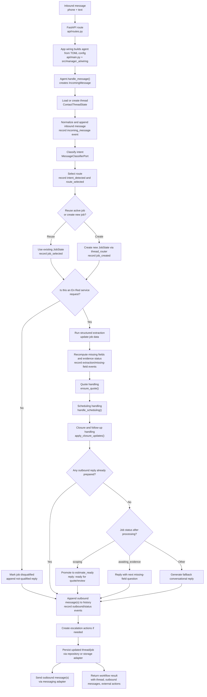

# Message Flow Diagram

This diagram shows the rough runtime path of one inbound message until the app decides on outbound replies and persistence.

It is intentionally simplified, but it follows the current `workflow_agent.Agent` flow closely enough to use as an orientation map.

## End-To-End Flow

## Main Decision Points

- Intent classification decides the route the message should take.
- Job selection decides whether the message continues an existing case or starts a new one.
- Service qualification can stop the normal flow early.
- Structured extraction determines whether enough information exists to move toward quoting.
- Quote, scheduling, reminder, and closure services may each add reply text or external actions.
- If nothing else created a reply, the agent falls back to a next-question or general conversational response.

## Rough Mental Model

You can think of the flow in four layers:

1. transport and wiring
   FastAPI route plus config-driven app assembly
2. thread/job orchestration
   load thread, classify message, pick job, record events
3. workflow services
   extraction, evidence status, quoting, scheduling, closure, escalation
4. side effects
   persist state, send replies, request external actions

## Related Docs

- `chatbot-behavior.md`
  for what the chatbot is supposed to do
- `implementation-architecture.md`
  for the surrounding technical structure
